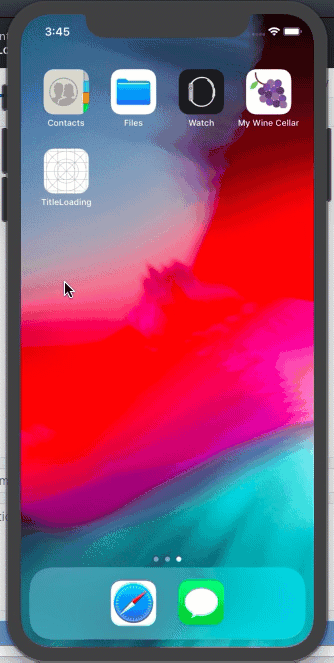
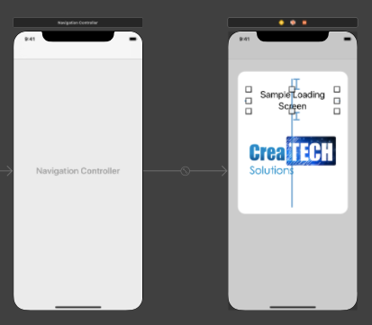
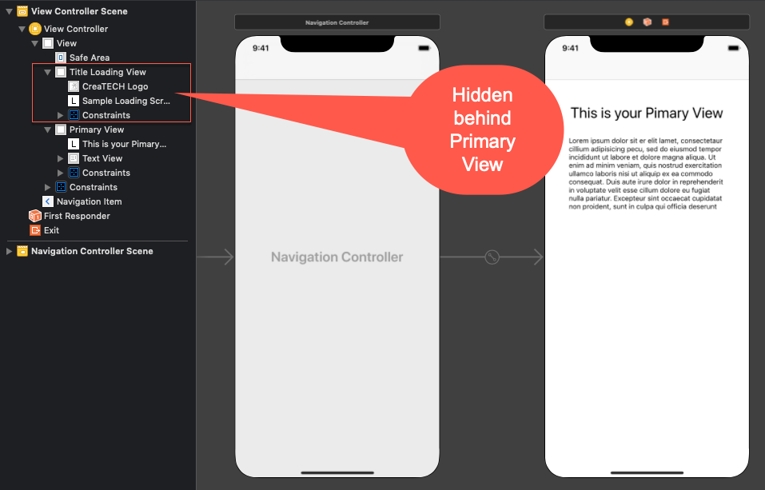
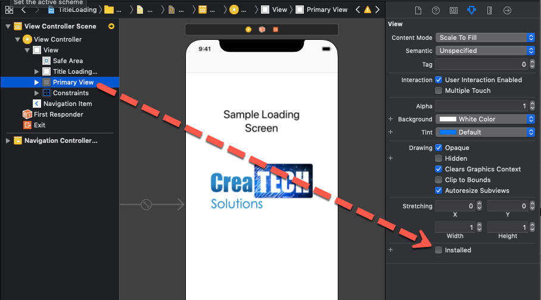

# TitleLoading


This project is to demonstrate how to display a loading screen and then display the content.

For this example, I did the following:

1. I embedded the launch screen in a Navigation Controller because my initial screen is in one too.

2. I Added a UIView to the Launch Screen and added content that is my title screen

   

3. I then took that same view and added it with the exact same constraints to the initial View Controller and then connected the view to as an outlet named **titleLoadingView**

4. I then added, on top of this view, another view that covers the entire screen and connected it as **primaryView**

   **Note:** because it is on top of the title view, the titleLoadingView cannot be seen.

5. I am now able to add content to my primary view
   

6. Now in ViewDidLoad, I can set the alpha value of primaryView to 0, and 1 for the titleLoadingView so when the launch screen disappears, the same screen is shown on the initial viewController.  Then I can use UIView animation to gradually fade out the titleLoadingView and bring in the primaryView.

7. ```swift
   override func viewDidLoad() {
           super.viewDidLoad()
           primaryView.alpha = 0
           UIView.animate(withDuration: 2.0) {
               self.titleLoadingView.alpha = 0
               self.primaryView.alpha = 1
           }
           
       }
   ```

8. To make it easier to design and make changes to the titleLoadingView, you can temporarily uncheck "installed" on the **primaryView** so it is not shown on the storyboard and you can edit the **titleLoadingView** that is behind it.



